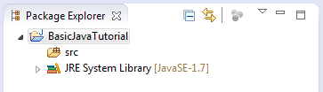

# 2.01-Java快速入门

[TOC]

初学者快速学习Java

## 1- 介绍

首先，学习Java需要什么，先阅这里，这里列出一些开发工具和环境配置：

- [http://www.yiibai.com/java/what-is-needed-to-get-started-with-java.html](what-is-needed-to-get-started-with-java.html)

## 2- 创建一个工程

首先，我们使用Eclipse（注意就是Eclise，如果没有安装好，选安装好再接着下一个步骤）创建一个新的项目，这将在本教程中使用。


输入项目名称：

- **BasicJavaTutorial**


项目已创建：



注：为了能够在除英语工程其他语言可以使用，应该切换到UTF-8编码。

右键单击该项目并选择属性：


## 3- 原始数据类型

JAVA中有八种基本类型

- 对于整数有4种类型：**byte, short, int, long**
- 实数类型：**float , double**
- 字符类型： **char**
- 布尔： 返回 **true** 或 **false** 值 (true 或 false)

| 类型      | 描述    | bit  | 最小值                               | 最大值                                |
| ------- | ----- | ---- | --------------------------------- | ---------------------------------- |
| byte    | 8位整数  | 8    | -128 (-2^7)                       | 127 (2^7-1)                        |
| short   | 16位整数 | 16   | -32,768 (-2^15)                   | 32,767 (2^15 -1)                   |
| int     | 32位整数 | 32   | - 2,147,483,648(-2^31)            | 2,147,483,647(2^31 -1)             |
| long    | 64位整数 | 64   | -9,223,372,036,854,775,808(-2^63) | 9,223,372,036,854,775,807(2^63 -1) |
| float   | 32位实数 | 32   | -3.4028235 x 10^38                | 3.4028235 x 10^38                  |
| double  | 64位实数 | 64   | -1.7976931348623157 x 10^308      | 1.7976931348623157 x 10^308        |
| boolean | 逻辑类型  |      | false                             | true                               |
| char    | 字符    | 16   | '\u0000' (0)                      | '\uffff' (65,535).                 |

## 4- 变量

右键点击 **src **并选择 "**New/Package**":


新建命名包是：

- com.yiibai.tutorial.javabasic.variable


输入类的名称：

- **VariableExample1**


创建 VariableExample1 类如下：


- **VariableExample1.java**

```java
package com.yiibai.tutorial.javabasic.variable;

public class VariableExample1 {

    public static void main(String[] args) {

        // Declare a variable of type int (integer 32-bit)
        int firstNumber;

        // Assigning values to firstNumber
        firstNumber = 10;

        System.out.println("First Number =" + firstNumber);

        // Declare a 32-bit real number (float)
        // This number is assigned a value of 10.2
        float secondNumber = 10.2f;

        System.out.println("Second Number =" + secondNumber);

        // Declare a 64-bit real numbers
        // This number is assigned a value of 10.2
        // character d at the end to tell with Java this is the type double.
        // Distinguished from a float.
        double thirdNumber = 10.2d;

        System.out.println("Third Number =" + thirdNumber);

        // Declare a character
        char ch = 'a';

        System.out.println("Char ch= " + ch);

    }
}
```

运行类 **VariableExample1**:

在 VariableExample1 类右键单击选择 "Run As/Java Application"：


运行类，在控制台上看到的结果如下：


您也可以一次声明多个变量，下例说明了这一点：

创建一个新的类 **VariableExample2**

- **VariableExample2.java**

```java
package com.yiibai.tutorial.javabasic.variable;

public class VariableExample2 {

    public static void main(String[] args) {

        // Declare three 64-bit integer (long)
        long firstNumber, secondNumber, thirdNumber;

        // Assign value to firstNumber
        // L at the end to tell java a long type, distinguished from type int.
        firstNumber = 100L;

        // Assign values to secondNumber
        secondNumber = 200L;

        // Assign values to thirdNumber
        thirdNumber = firstNumber + secondNumber;

        System.out.println("First Number = " + firstNumber);
        System.out.println("Second Number = " + secondNumber);
        System.out.println("Third Number = " + thirdNumber);
    }

}
```

运行类 VariableExample2 的结果 :


## 5- 控制流

## 5.1- if-else语句

if-else 语句的结构是：

```java
if(condition1 true)  {
 // Do something here
}elseif(condition2 true) {
 // Do something here
}elseif(condition3 true) {
 // Do something here
}else  { // Other
 // Do something here
}
```

创建一个类 ElseIfExample1:


- **ElseIfExample1.java**

```java
package com.yiibai.tutorial.javabasic.controlflow;

public class ElseIfExample1 {

    public static void main(String[] args) {

        // Declaring a integer number (int)        
        int score = 20;

        System.out.println("Your score =" + score);

        // If the score is less than 50
        if (score < 50) {
            System.out.println("You are not pass");
        }

        // Else if the score more than or equal to 50 and less than 80.
        else if (score >= 50 && score < 80) {
            System.out.println("You are pass");
        }

        // Remaining cases (that is greater than or equal to 80)
        else {
            System.out.println("You are pass, good student!");
        }

    }
}
```

运行 ElseIfExample1 类的结果：


改变在上面的例子中，变量“score”的值，然后重新运行ElseIfExample1类：

```
int score = 80;
```

## 5.2- 常规操作符

- \> 大于号
- < 小于号
- \>= 大于或等于
- <= 小于或等于
- && 且
- || 或
- == 等一个值
- != 不等于一个值
- ! 非

创建一个类 **ElseIfExample2**

- **ElseIfExample2.java**

```java
package com.yiibai.tutorial.javabasic.controlflow;

public class ElseIfExample2 {
    public static void main(String[] args) {

        // Declare a variable int simulate your age.
        int age = 20;

        // Test age less than or equal 17
        if (age <= 17) {
            System.out.println("You are 17 or younger");
        }

        // Test age equals 18
        else if (age == 18) {
            System.out.println("You are 18 year old");
        }

        // Test age, greater than 18 and less than 40
        else if (age > 18 && age < 40) {
            System.out.println("You are between 19 and 39");
        }

        // Remaining cases (Greater than or equal to 40)
        else {
            // Nested if statements
            // Test age not equals 50.
            if (age != 50) {
                System.out.println("You are not 50 year old");
            }

            // Negative statements
            if (!(age == 50)) {
                System.out.println("You are not 50 year old");
            }

            // If age is 60 or 70
            if (age == 60 || age == 70) {
                System.out.println("You are 60 or 70 year old");
            }

        }

    }
}
```

您可以修改 “age” 的值，然后重新运行 ElseIfExample2 类，并查看结果。

## 5.3- 布尔值

布尔是一种数据类型，它只有两个值true或false。

创建一个类 **BooleanExample**

- **BooleanExample.java**

```java
package com.yiibai.tutorial.javabasic.controlflow;

public class BooleanExample {
    public static void main(String[] args) {

        // Declare a variable of type boolean
        boolean value = true;

        // If value is true
        if (value == true) {
            System.out.println("It's true");
        }
        // Else
        else {
            System.out.println("It's false");
        }

        // With boolean values you can also write
        if (value) {
            System.out.println("It's true");
        }
        // Else
        else {
            System.out.println("It's false");
        }
    }
}
```

## 5.4- switch- case -default 语句

这也是类似上面介绍的 if-else 分支语句：

```java
switch( variable_to_test ) {
  casevalue:
   // code_here;
   break;
  casevalue:
   // code_here;
   break;
  default:
   // values_not_caught_above;
}
```

- SwitchExample1.java

```java
package com.yiibai.tutorial.javabasic.controlflow;

public class SwitchExample1 {
    public static void main(String[] args) {

        // Declare a variable age
        int age = 20;

        // Check the value of age
        switch (age) {

        // Case age = 18
        case 18:
            System.out.println("You are 18 year old");
            break;

        // Case age = 20
        case 20:
            System.out.println("You are 20 year old");
            break;

        // Remaining cases
        default:
            System.out.println("You are not 18 or 20 year old");
        }

    }
}
```

运行类 SwitchExample1 的结果 :

```
You are 20 year old
```

请注意case语句是一个特定的值，不能做下面的操作：

```java
// This is not allowed !!
case(age < 18) :
 
// case only accept a specific value eg:
case18:
  // Do something here
  break;
```

看下面的一个例子：

- **SwitchExample2.java**

```java
package com.yiibai.tutorial.javabasic.controlflow;

public class SwitchExample2 {
    public static void main(String[] args) {

        // Declare a variable age
        int age = 30;

        // Check the value of age
        switch (age) {

        // Case age = 18
        case 18:
            System.out.println("You are 18 year old");

        // Case age in 20, 30, 40
        case 20:
        case 30:
        case 40:
            System.out.println("You are " + age);
            break;

        // Remaining case:
        default:
            System.out.println("Other age");
        }

    }
}
```

运行结果：

```
You are 30
```

## 5.5- for循环

语法：

```java
for( start_value; end_value; increment_number ) {
  // Code here
}
```

考虑如下一个例子：

- **ForLoopExample1.java**

```java
packageorg.o7planning.tutorial.javabasic.loop;
 
publicclass ForLoopExample1 {
 
    public static void main(String[] args) {
 
        // Declare a variable, step in loop
        intstep = 1;
 
        // Declare a variable value with the start value is 0
        // After each iteration, value will increase 3
        // And the loop will end when the value greater than or equal to 10
        for(intvalue = 0; value < 10; value = value + 3) {
 
            System.out.println("Step ="+ step + "  value = "+ value);
 
            // Increase 1
            step = step + 1;
 
        }
 
    }
 
}
```

运行 **ForLoopExample1 **类结果：

```
Step =1  value = 0
Step =2  value = 3
Step =3  value = 6
Step =4  value = 9
```

另一实例中，从1至100的数字求和：

- ForLoopExample2.java

```java
package com.yiibai.tutorial.javabasic.loop;

public class ForLoopExample1 {
    public static void main(String[] args) {

        // Declare a variable, step in loop
        int step = 1;

        // Declare a variable value with the start value is 0
        // After each iteration, value will increase 3
        // And the loop will end when the value greater than or equal to 10
        for (int value = 0; value < 10; value = value + 3) {

            System.out.println("Step =" + step + "  value = " + value);

            // Increase 1
            step = step + 1;

        }

    }
}
```

结果：

```
5050
```

## 5.6- while循环

这是 while 循环结构：
```
// While the condition is true, then do something.
while( 条件为真 ) {
	// Do something here.
}`
```
参见图示

- WhileExample1.java

```java
publicclassWhileExampe1 {
 
     
    publicstaticvoidmain(String[] args)  {
         
        intvalue = 3;
         
        // While the value is less than 10, the loop is working.
        while( value < 10)  {
             
            System.out.println("Value = "+ value);
             
            // Increase value by adding 2
            value = value + 2;
        }
    }
}
```

## 5.7- do-while循环

下面是do-while循环的结构：

```java
// The do-while loop to work at least one round
// and while the condition is true, it also works to
do{
  // Do something here.
}while( condition );
```

如下图的示例：

- DoWhileExample1.java

```java
package com.yiibai.tutorial.javabasic.loop;

public class DoWhileExample1 {

    public static void main(String[] args) {

        int value = 3;

        // do-while loop will execute at least once
        do {

            System.out.println("Value = " + value);

            // Increase 3
            value = value + 3;

        } while (value < 10);

    }
}
```

结果：

```
Value = 3
Value = 6
Value = 9
```

## 6- Java数组

## 6.1- 什么是数组？

数组是元素存储在彼此相邻列表。

让我们来看看，一个数组有5个int型的元素。

## 6.2- 使用数组

如何在Java中声明数组。

```java
// Declare an array, not a specified number of elements.
int[] array1;
 
 
// Initialize the array with 100 elements
// The element has not been assigned a specific value
array1 = newint[100];
 
// Declare an array specifies the number of elements
// The element has not been assigned a specific value
double[] array2 = newdouble[10];
 
// Declare an array whose elements are assigned specific values.
// This array with 4 elements
long[] array3= {10L, 23L, 30L, 11L};
```

让我们来看一个例子：

- ArrayExample1.java

```java
package com.yiibai.tutorial.javabasic.array;

public class ArrayExample1 {

    public static void main(String[] args) {

        // Declare an array with 5 elements
        int[] myArray = new int[5];

        // Note: the first element of the array index is 0:

        // Assigning values to the first element (index 0)
        myArray[0] = 10;

        // Assigning values to the second element (index 1)
        myArray[1] = 14;

        myArray[2] = 36;
        myArray[3] = 27;

        // Value for the 5th element (the last element in the array)
        myArray[4] = 18;

        // Print out element count.
        System.out.println("Array Length=" + myArray.length);

        // Print to Console element at index 3 (4th element in the array)
        System.out.println("myArray[3]=" + myArray[3]);

        // Use a for loop to print out the elements in the array.
        for (int index = 0; index < myArray.length; index++) {
            System.out.println("Element " + index + " = " + myArray[index]);
        }
    }
}
```

结果：

```java
Array Length=5
myArray[3]=27
Element 0 = 10
Element 1 = 14
Element 2 = 36
Element 3 = 27
Element 4 = 18
```

举一个实例来说明使用一个for循环来对元素赋值：

- ArrayExample2.java

```java
package com.yiibai.tutorial.javabasic.array;

public class ArrayExample2 {
    public static void main(String[] args) {

        // Declare an array with 5 elements
        int[] myArray = new int[5];

        // Print out element count
        System.out.println("Array Length=" + myArray.length);

        // Using loop assign values to elements of the array.
        for (int index = 0; index < myArray.length; index++) {
            myArray[index] = 100 * index * index + 3;
        }

        // Print out the element at index 3
        System.out.println("myArray[3] = "+ myArray[3]);
    }
}
```

```
Array Length=5
myArray[3] = 903
```

# 7- 类, 继承, 构造器

有三个概念需要进行区分：

- 类
- 构造
- 继承

当我们讨论树，它是抽象的东西，它是一个类。但是，当我们指出了一个特定的树（比如：槟榔树），很明显，那就是实例。

或者，当我们谈论的人，这是抽象的，它是一个类。但是，当指向你或我，这是两种不同的情况下，都是同一个 Person 类。

- **Person.java**

```java
package com.yiibai.tutorial.javabasic.javastructure;

public class Person {
    // This is field
    // The name of Person
    public String name;

    // This is a Constructor
    // Use it to initialize the object (Create new object)
    // This constructor has one parameter
    // Constructor always have the same name as the class.
    public Person(String persionName) {
        // Assign the value of the parameter into the 'name' field
        this.name = persionName;
    }

    // This method returns a String ..
    public String getName() {
        return this.name;
    }
}
```

Person类没有任何main函数。 TestPerson类通过构造函数初始化Person对象实例

- **PersonTest.java**

```java
package com.yiibai.tutorial.javabasic.javastructure;

public class PersonTest {

       public static void main(String[] args) {

           // Create an object of class Person
           // Initialize this object via constructor of class Person
           // Specifically, Edison
           Person edison = new Person("Edison");

           // Class Person has the method getName()
           // Use the object to call getName():
           String name = edison.getName();
           System.out.println("Person 1: " + name);

           // Create an object of class Person
           // Initialize this object via constructor of class Person
           // Specifically, Bill Gates
           Person billGate = new Person("Bill Gates");

           // Class Person has field name (public)
           // Use objects to refer to it.
           String name2 = billGate.name;
           System.out.println("Person 2: " + name2);

       }

    }
```

运行示例的结果如下：

```
Person 1: Edison
Person 2: Bill Gates
```

## 8- 字段

在本节中，我们将讨论一些概念：

- 一般字段
- 静态字段
- final字段
- static final 字段

下面看看字段和静态字段的例子。

- FieldSample.java

```java
package com.yiibai.tutorial.javabasic.javastructure;

public class FieldSample {

    // This is static field.
    public static int MY_STATIC_FIELD = 100;

    // This is normal field.
    public String myValue;


    // Constructor
    public FieldSample(String myValue)  {
        this.myValue= myValue;
    }

}
```

- FieldSampleTest.java

```java
package com.yiibai.tutorial.javabasic.javastructure;

public class FieldSampleTest {

    public static void main(String[] args) {

        // Create the first object.
        FieldSample obj1 = new FieldSample("Value1");

        System.out.println("obj1.myValue= " + obj1.myValue);

        // Print out static value, access via instance of class (an object).
        System.out.println("obj1.MY_STATIC_FIELD= " + obj1.MY_STATIC_FIELD);

        // Print out static value, access via class.
        System.out.println("FieldSample.MY_STATIC_FIELD= "
                + FieldSample.MY_STATIC_FIELD);

        // Create second object:
        FieldSample obj2 = new FieldSample("Value2");

        System.out.println("obj2.myValue= " + obj2.myValue);

        // Print out static value, access via instance of class (an object)
        System.out.println("obj2.MY_STATIC_FIELD= " + obj2.MY_STATIC_FIELD);

        System.out.println(" ------------- ");

        // Set new value for static field.
        // (Or using: FieldSample.MY_STATIC_FIELD = 200)
        obj1.MY_STATIC_FIELD = 200;

        // It will print out the value 200.
        System.out.println("obj2.MY_STATIC_FIELD= " + obj2.MY_STATIC_FIELD);
    }
}
```

运行示例的结果：

```
obj1.myValue= Value1
obj1.MY_STATIC_FIELD= 100
FieldSample.MY_STATIC_FIELD= 100
obj2.myValue= Value2
obj2.MY_STATIC_FIELD= 100
 ------------- 
obj2.MY_STATIC_FIELD= 200
```

最后一个字段是不能一个新值分配给它的，它就像一个常数。

- **FinalFieldExample.java**

```java
package com.yiibai.tutorial.javabasic.javastructure;

public class FinalFieldExample {

    // A final field.
    // Final Field does not allow to assign new values.
    public final int myValue = 100;

    // A static final field.
    // Final field does not allow to assign new values.
    public static final long MY_LONG_VALUE = 1234L;
}
```

## 9- 方法

- 方法
- 静态方法
- final 方法 (将在类的继承中说明)


- MethodSample.java

```java
package com.yiibai.tutorial.javabasic.javastructure;

public class MethodSample {

    public String text = "Some text";

    // Default Constructor
    public MethodSample()  {

    }

    // This method return a String
    // and has no parameter.
    public String getText() {
        return this.text;
    }

    // This is a method with one parameter String.
    // This method returns void (not return anything)    
    public void setText(String text) {
        // this.text reference to the text field.
        // Distinguish the text parameter.        
        this.text = text;
    }

    // Static method
    public static int sum(int a, int b, int c) {
        int d =  a + b + c;
        return d;
    }
}
```

- MethodSampleTest.java

```java
package com.yiibai.tutorial.javabasic.javastructure;

public class MethodSampleTest {

    public static void main(String[] args) {

        // Create instance of MethodSample
        MethodSample obj = new MethodSample();

        // Call getText() method
        String text = obj.getText();

        System.out.println("Text = " + text);

        // Call method setText(String)
        obj.setText("New Text");

        System.out.println("Text = " + obj.getText());

        // Static method can be called through the class.
        // This way is recommended. (**)
        int sum = MethodSample.sum(10, 20, 30);

        System.out.println("Sum  10,20,30= " + sum);

        // Or call through objects
        // This way is not recommended. (**)        
        int sum2 = obj.sum(20, 30, 40);

        System.out.println("Sum  20,30,40= " + sum2);
    }

}
```

```
Text = Some text
Text = New Text
Sum  10,20,30= 60
Sum  20,30,40= 90
```

## 10- 在Java中的继承

Java允许从其他类扩展类。类扩展另一个类称为子类。 子类必须有继承父类中的字段和方法的能力。

- Animal.java

```java
package com.yiibai.tutorial.javabasic.inheritance;

public class Animal {

    public Animal() {

    }

    public void move() {
        System.out.println("Move ...!");
    }

    public void say() {
        System.out.println("<nothing>");
    }

}
```

- Cat.java

```java
package com.yiibai.tutorial.javabasic.inheritance;

public class Cat extends Animal {

    // Override method of the Animal class.
    public void say() {
        System.out.println("I am Cat");
    }

}
```

- Dog.java

```java
package com.yiibai.tutorial.javabasic.inheritance;

public class Dog extends Animal {

    // Override method of the Animal class.
    public void say() {
        System.out.println("I am Dog");
    }
}
```

- Ant.java

```java
package com.yiibai.tutorial.javabasic.inheritance;

public class Ant extends Animal {

}
```

- AnimalTest.java

```java
package com.yiibai.tutorial.javabasic.inheritance;

public class AnimalTest {

    public static void main(String[] args) {

        // Declaring a Cat object.
        Cat cat = new Cat();

        // Check 'cat' instance of Animal.
        // The result is clearly true.
        boolean isAnimal = cat instanceof Animal;
        System.out.println("cat instanceof Animal?"+ isAnimal);

        // ==> Meo
        // Call the method say() of the Cat.
        cat.say();


        // Declare an object Animal
        // Initialize the object through the Constructor of the Cat.
        Animal cat2 = new Cat();

        // ==> Meo
        // Call to say() of Cat (Not Animal)
        cat2.say();

        // Create the object Animal
        // Through the Constructor of the class Ant.        
        Animal ant = new Ant();

        // Ant has no say() method.
        // It call to say() method that inherited from the parent class (Animal)        
        ant.say();
    }
}
```

运行示例的结果如下：

```
cat instanceof Animal?true
I am Cat
I am Cat
<nothing>
```

来源： [http://www.yiibai.com/java/java_quick_guide.html](http://www.yiibai.com/java/java_quick_guide.html)
