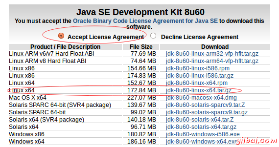
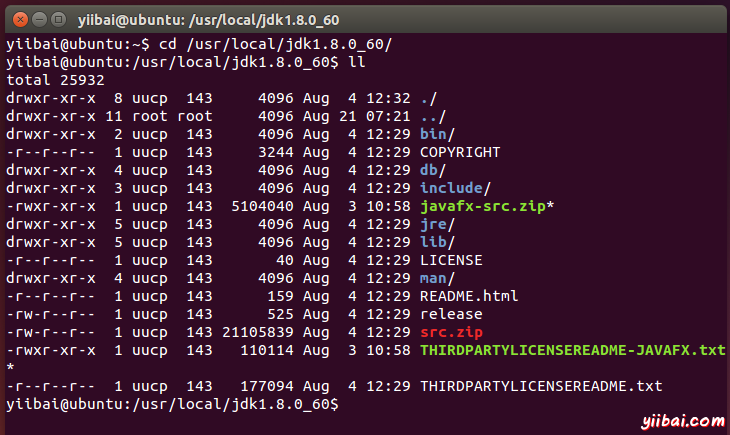
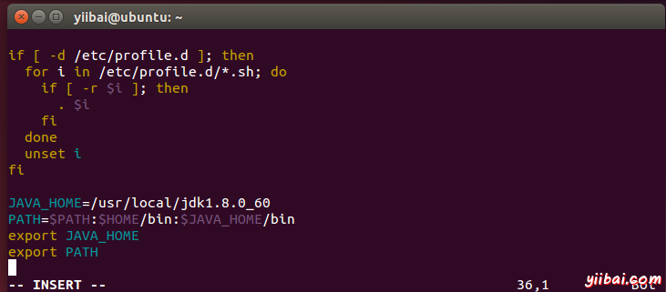

# 2.02-安装Java环境（Linux）

[TOC]

在开始设置使用 Java 之前，则需要从系统中删除 OpenJDK/JRE。

要做到这一点，请使用以下命令 ：

```
yiibai@ubuntu:~$ sudo apt-get purge openjdk-\*
```


系统会要求确认。确认删除则输入：Y，等待一段时间后，卸载完成！

**Step 2) 检查 Ubuntu 操作系统的架构是32位还是64位。**

可以使用下面的命令：

```
yiibai@ubuntu:~$ file /sbin/init
```


**Step 3) 从 Oracle 站点下载最新版本的 Java 安装包**

一个 zip 文件，例如，jdk-8-linux-x64.tar.gz
链接如下：[http://www.oracle.com/technetwork/java/javase/downloads/index.html](../../www.oracle.com/technetwork/java/javase/downloads/index.html)，如下图所示：


接受许可协议。

- 对于32位系统选择86
- 对于64位系统，选择64
- Ubuntu 选择 tar.gz （本教程中下载使用）
- 对于基于 Debian 系统选择 rpm

  


下载完成后，会看到如下图所示（Firefox中）：


**Step 3) 在终端，浏览到下载的 Java zip 文件的位置**

```
yiibai@ubuntu:~$ cd /home/yiibai/Downloads
yiibai@ubuntu:~/Downloads$ 
```

选择一个目录提取 java zip 文件的内容。

在本教程中，我们将提取的下载文件到 /usr/local ，如下命令：

```
yiibai@ubuntu:~$ sudo tar -xvf jdk-8u60-linux-64.tar.gz -C /usr/local

```


输入密码，如果有要求。解压缩继续。完成后会看到下面的 /usr/local/jdk1.8.0_60 文件夹的内容：



**Step 4) 添加下面内空到系统变量，即 /etc/profile 文件的结束**

```
JAVA_HOME=/usr/local/jdk1.8.0_60
PATH=$PATH:$HOME/bin:$JAVA_HOME/bin
export JAVA_HOME
export PATH
```

在使用 VI 打开 /etc/profile 文件，如下命令：

```
yiibai@ubuntu:~$ vi /etc/profile
```

在文件的最后位置，写入 Java 的环境变量，如下图所示：



返回 vi 的命令模式，输入 :wq 保存文件完成！

**Step 5) 现在让 Ubuntu 知道 JDK/JRE 的位置**

复制 - 粘贴以下行到命令提示符。

```
yiibai@ubuntu:~$ sudo update-alternatives --install "/usr/bin/java" "java" "/usr/local/jdk1.8.0_60/bin/java" 1
yiibai@ubuntu:~$ sudo update-alternatives --install "/usr/bin/javac" "javac" "/usr/local/jdk1.8.0_60/bin/javac" 1
yiibai@ubuntu:~$ sudo update-alternatives --install "/usr/bin/javaws" "javaws" "/usr/local/jdk1.8.0_60/bin/javaws" 1
```

具体执行如下图所示：


**Step 6). 告诉 Ubuntu 我们安装的即 jdk1.8.0_60 必须是默认的Java**

请使用以下命令来完成：

```
yiibai@ubuntu:~$ sudo update-alternatives --set java /usr/local/jdk1.8.0_60/bin/java
yiibai@ubuntu:~$ sudo update-alternatives --set javac /usr/local/jdk1.8.0_60/bin/javac
yiibai@ubuntu:~$ sudo update-alternatives --set javaws /usr/local/jdk1.8.0_60/bin/javaws
```

执行结果如下：


**Step 7). 使用下面的命令来测试安装 Java 的结果，**

```
yiibai@ubuntu:~$ java -version
```


安装成功将显示信息，看到如上面的截图应该一样。

来源： [http://www.yiibai.com/java/how-to-install-java-on-ubuntu.html](http://www.yiibai.com/java/how-to-install-java-on-ubuntu.html)