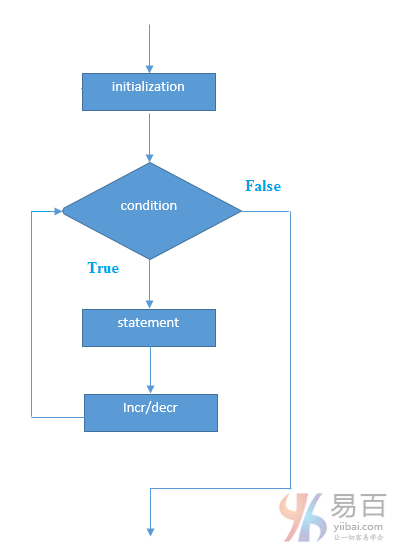

# 3.03-Java for循环

[TOC]

Java **for循环**用于多次迭代程序的一部分，或者多次执行同一个代码块。如果迭代次数是固定的，建议使用`for`循环。

java中有三种类型的`for`循环。如下所示 -

- 简单`for`循环
- `for-each`或增强型`for`循环
- 标记`for`循环

## 1. Java简单For循环

简单的`for`循环与`C/C++`相同。我们可以初始化变量，检查条件和增加/减少变量的值。

**语法：**

```java
for(initialization;condition;incr/decr){  
    //code to be executed  
}

```

执行流程图如下所示 -



**示例：**

```java
public class ForExample {  
    public static void main(String[] args) {  
        for(int i=1;i<=10;i++){  
            System.out.println(i);  
        }  
    }  
}

```

执行上面的代码，输出如下 -

```
1
2
3
4
5
6
7
8
9
10

```

## 2. Java for-each循环

`for-each`循环用于在java中遍历数组或集合。它比简单的`for`循环更容易使用，因为不需要递增值和使用下标符号。

**语法：**

```java
for(Type var:array){  
   //code to be executed  
}

```

**示例：**

```java
public class ForEachExample  {
    public static void main(String[] args) {
        int arr[] = { 12, 23, 44, 56, 78 };
        for (int i : arr) {
            System.out.println(i);
        }
    }
}

```

执行上面的代码，得到如下结果 -

```
12
23
44
56
78

```

## 3. Java标记For循环

我们可以让每个`for`循环的名称。 为此，在`for`循环之前使用标签。它是有用的，如果在嵌套`for`循环中，可以使用`break/continue`指定循环。

通常，`break`和`continue`关键字断开/继续最内循环。

**语法：**

```java
labelname:  
for(initialization;condition;incr/decr){  
    //code to be executed  
}

```

**示例：**

```java
public class LabeledForExample  {
    public static void main(String[] args) {
        aa: for (int i = 1; i <= 3; i++) {
            bb: for (int j = 1; j <= 3; j++) {
                if (i == 2 && j == 2) {
                    break aa;
                }
                System.out.println(i + " " + j);
            }
        }
    }
}

```

执行上面的代码，得到如下结果 -

```
1 1
1 2
1 3
2 1

```

如果使用`break bb`;它将打断内循环，这是任何循环的默认行为。

```
public class LabeledForExample {
    public static void main(String[] args) {
        aa: for (int i = 1; i <= 3; i++) {
            bb: for (int j = 1; j <= 3; j++) {
                if (i == 2 && j == 2) {
                    break bb;
                }
                System.out.println(i + " " + j);
            }
        }
    }
}

```

执行上面的代码，得到如下结果 -

```
1 1
1 2
1 3
2 1
3 1
3 2
3 3

```

## 4. Java无限循环

在`for`循环中，如果使用两个分号`;`，则它对于循环将是不定式的。

**语法：**

```java
for(;;){  
    //code to be executed  
}

```

**示例：**

```java
public class ForExample {
    public static void main(String[] args) {
        for (;;) {
            System.out.println("infinitive loop");
        }
    }
}

```

执行上面的代码，得到如下结果 -

```
infinitive loop
infinitive loop
infinitive loop
infinitive loop
infinitive loop
ctrl+c

```

> 提示： 在执行上面的程序时，您需要按`ctrl + c`退出程序。

来源： [http://www.yiibai.com/java/java-for-loop.html#article-start](http://www.yiibai.com/java/java-for-loop.html#article-start)