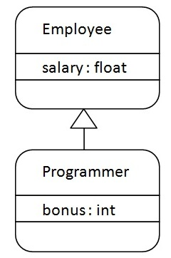
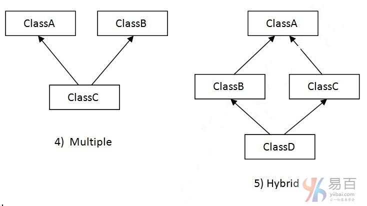

# 4.07-Java继承

[TOC]

Java中的继承是一种机制，表示为一个对象获取父对象的所有属性和行为。

在Java中继承是：可以创建基于现有类构建新的类。 当您从现有类继承时，就可以重复使用父类的方法和字段，也可以在继承的新类中添加新的方法和字段。

继承表示**IS-A**关系，也称为父子关系。

## 为什么在java中使用继承？

对于方法覆盖(因此可以实现运行时的多态性)，提高代码可重用性。在Java中，子类可继承父类中的方法，而不需要重新编写相同的方法。但有时子类并不想原封不动地继承父类的方法，而是想作一定的修改，这就需要采用方法的重写(覆盖)。

**Java继承的语法**

```java
class Subclass-name extends Superclass-name  
{  
   //methods and fields  
}

```

`extends`关键字表示正在从现有类派生创建的新类。 “`extends`”的含义是增加功能。在Java的术语中，继承的类称为父类或超类，新类称为子或子类。

**Java继承示例**



如上图所示，`Programmer`是子类，`Employee`是超类。 两个类之间的关系是`Programmer IS-A Employee`. 它表示 `Programmer` 是一种 `Employee` 的类型。

参考下面示例代码的实现 -

```java
class Employee {
    float salary = 40000;
}

class Programmer extends Employee {
    int bonus = 10000;

    public static void main(String args[]) {
        Programmer p = new Programmer();
        System.out.println("Programmer salary is:" + p.salary);
        System.out.println("Bonus of Programmer is:" + p.bonus);
    }
}

```

执行上面代码得到以下结果 -

```
Programmer salary is:40000.0
Bonus of programmer is:10000

```

在上面的例子中，`Programmer`对象可以访问自身类以及`Employee`类的字段，即提高了代码可重用性。

## java继承类型

在类的基础上，在java中可以有三种类型的继承：单一，多级和分层。在Java编程中，仅能通过接口支持多重和混合继承。稍后章节中我们将了解学习接口的应用。


> 注意：在java中的类不支持多继承。

当一个类扩展多个类，即被称为多重继承。 例如：



### (1). 单一继承示例

文件 `TestInheritance.java` 中的代码如下 -

```java
class Animal {
    void eat() {
        System.out.println("eating...");
    }
}

class Dog extends Animal {
    void bark() {
        System.out.println("barking...");
    }
}

class TestInheritance {
    public static void main(String args[]) {
        Dog d = new Dog();
        d.bark();
        d.eat();
    }
}

```

执行上面代码得到以下结果 -

```
barking...
eating...

```

### (2). 多级继承示例

文件 `TestInheritance2.java` 中的代码如下 -

```java
class Animal {
    void eat() {
        System.out.println("eating...");
    }
}

class Dog extends Animal {
    void bark() {
        System.out.println("barking...");
    }
}

class BabyDog extends Dog {
    void weep() {
        System.out.println("weeping...");
    }
}

class TestInheritance2 {
    public static void main(String args[]) {
        BabyDog d = new BabyDog();
        d.weep();
        d.bark();
        d.eat();
    }
}

```

执行上面代码得到以下结果 -

```
weeping...
barking...
eating...

```

### (3). 多级继承示例

文件 `TestInheritance3.java` 中的代码如下 -

```java
class Animal {
    void eat() {
        System.out.println("eating...");
    }
}

class Dog extends Animal {
    void bark() {
        System.out.println("barking...");
    }
}

class Cat extends Animal {
    void meow() {
        System.out.println("meowing...");
    }
}

class TestInheritance3 {
    public static void main(String args[]) {
        Cat c = new Cat();
        c.meow();
        c.eat();
        // c.bark();//C.T.Error
    }
}

```

执行上面代码得到以下结果 -

```
meowing...
eating...

```

**问题：为什么在Java中不支持多重继承？**

为了降低复杂性并简化语言，Java中不支持多重继承。想象一个：**A**，**B**和**C**是三个类。 **C**类继承**A**和**B**类。 如果**A**和**B**类有相同的方法，并且从子类对象调用它，**A**或**B**类的调用方法会有歧义。

因为编译时错误比运行时错误好，如果继承`2`个类，java会在编译时报告错误。 所以无论子类中是否有相同的方法，都会有报告编译时错误。例如下面的代码是编译出错的。

```java
class A {
    void msg() {
        System.out.println("Hello");
    }
}

class B {
    void msg() {
        System.out.println("Welcome");
    }
}

class C extends A,B
{//suppose if it were  

 Public Static

    void main(String args[]) {
        C obj = new C();
        obj.msg();// Now which msg() method would be invoked?
    }
}
```

来源： [http://www.yiibai.com/java/inheritance-in-java.html#article-start](http://www.yiibai.com/java/inheritance-in-java.html#article-start)