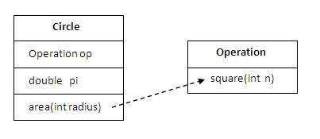

# 4.08-Java聚合

[TOC]

聚合

如果一个类有一个类的实体引用(类中的类)，则它称为聚合。 聚合表示**HAS-A**关系。
考虑有一种情况，`Employee`对象包含许多信息，例如：`id`，`name`，`emailId`等。它包含另一个类对象：`address`，其包含它自己的信息，例如：城市，州，国家，邮政编码等，如下所示。

```java
class Employee{  
    int id;  
    String name;  
    Address address;//Address is a class  
    ...  
}

```

在这种情况下，`Employee`有一个实体引用地址(`Address`)，因此关系是：`Employee HAS-A Address`。

## 为什么要使用聚合？

- 代码可重用性。

### 聚合的简单示例



在这个例子中，在`Circle`类中创建了`Operation`类的引用。

```java
class Operation {
    int square(int n) {
        return n * n;
    }
}

class Circle {
    Operation op;// aggregation
    double pi = 3.14;

    double area(int radius) {
        op = new Operation();
        int rsquare = op.square(radius);// code reusability (i.e. delegates the
                                        // method call).
        return pi * rsquare;
    }

    public static void main(String args[]) {
        Circle c = new Circle();
        double result = c.area(5);
        System.out.println(result);
    }
}

```

执行上面代码，得到以下结果 -

```
78.5

```

### 何时使用聚合？

- 当没有`is-a`关系时，通过聚合也能最好地实现代码重用。
- 只有在所涉及的对象的整个生命周期内维持关系为`is-a`时，才应使用继承; 否则，聚合是最好的选择。

### 　理解聚合的一个示例

在此示例中，`Employee`中拥有`Address`对象，`address`对象包含其自己的信息，例如城市，州，国家等。在这种情况下，关系是员工(`Employee`)`HAS-A`地址(`Address`)。

**Address.java**

```java
public class Address {
    String city, province;

    public Address(String city, String province) {
        this.city = city;
        this.province = province;
    }

}

```

**Emp.java**

```java
public class Emp {
    int id;
    String name;
    Address address;

    public Emp(int id, String name, Address address) {
        this.id = id;
        this.name = name;
        this.address = address;
    }

    void display() {
        System.out.println(id + " " + name);
        System.out.println(address.city + " " + address.province);
    }

    public static void main(String[] args) {
        Address address1 = new Address("广州", "广东");
        Address address2 = new Address("海口", "海南");

        Emp e = new Emp(111, "Wang", address1);
        Emp e2 = new Emp(112, "Zhang", address2);

        e.display();
        e2.display();

    }
}

```

执行上面代码，得到以下结果 -

```
111 Wang
广州 广东
112 Zhang
海口 海南
```

来源： [http://www.yiibai.com/java/aggregation-in-java.html#article-start](http://www.yiibai.com/java/aggregation-in-java.html#article-start)