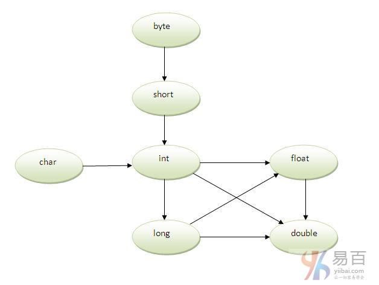

# 4.09-Java方法重载

如果一个类中有多个具有相同名称但参数不同的方法，则称为方法重载。如果只需要执行一个操作，具有相同的方法名称将增加程序的可读性。

假设必须执行给定数值的添加操作(求和)，但是参数的数量不固定，如果为两个参数编写`add1(int，int)`方法，为三个参数编写`add2(int，int，int)`方法，可能对其他程序员来说很难理解这样的方法的行为，因为它的名称不同。

因此，执行方法重载能比较容易理解程序含义。

**方法重载的优点**

- 方法重载提高了程序的可读性。

**重载方法不同的方式**

在java中重载方法有两种方式，它们分别是：

- 通过改变参数的数量
- 通过更改数据类型

> 注意：在java中，只通过更改方法的返回类型来实现方法重载是不可以的。

## 1. 方法重载： 修改参数的数量

在这个例子中，我们将创建了两个方法，第一个`add()`方法执行两个数值的相加操作，第二个`add()`方法执行三个数值的相加操作。

在这个例子中，我们创建静态方法，所以不需要创建实例来调用方法。

```java
class Adder {
    static int add(int a, int b) {
        return a + b;
    }

    static int add(int a, int b, int c) {
        return a + b + c;
    }
}

class TestOverloading1 {
    public static void main(String[] args) {
        System.out.println(Adder.add(11, 11));
        System.out.println(Adder.add(11, 11, 11));
    }
}

```

上面代码执行后，输出结果如下 -

```
22
33

```

## 2. 方法重载：更改参数的数据类型

在这个例子中，创建了两种数据类型不同的方法。 第一个`add`方法接收两个整数参数，第二个`add`方法接收两个双精度型参数。

```java
class Adder {
    static int add(int a, int b) {
        return a + b;
    }

    static double add(double a, double b) {
        return a + b;
    }
}

class TestOverloading2 {
    public static void main(String[] args) {
        System.out.println(Adder.add(11, 11));
        System.out.println(Adder.add(12.3, 12.6));
    }
}

```

上面代码执行后，输出结果如下 -

```
22
24.9

```

**问题：为什么方法重载不能通过更改方法的返回类型？**

在java中，只通过改变方法的返回类型来实现方法重载是不可能的，因为这样具有模糊性。 让我们来看看模糊性是怎么样发生的：

```java
class Adder {
    static int add(int a, int b) {
        return a + b;
    }

    static double add(int a, int b) {
        return a + b;
    }
}

class TestOverloading3 {
    public static void main(String[] args) {
        System.out.println(Adder.add(11, 11));// ambiguity
    }
}

```

上面代码执行后，输出结果如下 -

```
Compile Time Error: method add(int,int) is already defined in class Adder

```

`System.out.println(Adder.add(11,11));`//这里，java如何确定应该调用哪个`sum()`方法？

> 注意：编译时错误优于运行时错误。 所以，如果你声明相同的方法具有相同的参数，java编译器渲染编译器时间错误。

**可以重载java main()方法吗？**

这是完全可以的。 可以通过方法重载在类中有任意数量的`main`方法。 但是JVM调用`main()`方法，它只接收字符串数组作为参数。 让我们来看一个简单的例子：

```java
class TestOverloading4{  
    public static void main(String[] args){

        System.out.println("main with String[]");
    }  
    public static void main(String args){

        System.out.println("main with String");
    }  
    public static void main(){

        System.out.println("main without args");
    }  
}

```

上面代码执行后，输出结果如下 -

```
main with String[]

```

## 方法重载和类型提升

如果没有找到匹配的数据类型，那么会隐式地将一个类型提升到另一个类型。 让我们通过下面的图示来理解这个概念：


如上图所示，`byte`可以被提升为`short`，`int`，`long`，`float`或`double`。 `short`数据类型可以提升为`int`，`long`，`float`或`double`。 `char`数据类型可以提升为`int`，`long`，`float`或`double`等等。

**使用类型提升方法重载的示例**

```java
class OverloadingCalculation1 {
    void sum(int a, long b) {
        System.out.println(a + b);
    }

    void sum(int a, int b, int c) {
        System.out.println(a + b + c);
    }

    public static void main(String args[]) {
        OverloadingCalculation1 obj = new OverloadingCalculation1();
        obj.sum(20, 20);// now second int literal will be promoted to long
        obj.sum(20, 20, 20);

    }
}

```

上面代码执行后，输出结果如下 -

```
40
60

```

**如果找到匹配使用类型提升方法重载示例**
如果方法中存在匹配类型参数，则不会执行类型提升方法重载。

```java
class OverloadingCalculation2 {
    void sum(int a, int b) {
        System.out.println("int arg method invoked");
    }

    void sum(long a, long b) {
        System.out.println("long arg method invoked");
    }

    public static void main(String args[]) {
        OverloadingCalculation2 obj = new OverloadingCalculation2();
        obj.sum(20, 20);// now int arg sum() method gets invoked
    }
}

```

上面代码执行后，输出结果如下 -

```
Output:int arg method invoked

```

**在模糊的情况下使用类型提升来实现方法重载的示例**

如果在方法中没有匹配的类型参数，并且每个方法都会提升相同数量的参数，那么会出现歧义。如下示例代码，将会产生编译时错误。

```java
class OverloadingCalculation3 {
    void sum(int a, long b) {
        System.out.println("a method invoked");
    }

    void sum(long a, int b) {
        System.out.println("b method invoked");
    }

    public static void main(String args[]) {
        OverloadingCalculation3 obj = new OverloadingCalculation3();
        obj.sum(20, 20);// now ambiguity
    }
}

```

> 注意： 只有一种类型不被隐式地去提升，例如`double`不能被隐含地提升到任何类型。

来源： [http://www.yiibai.com/java/method-overloading-in-java.html#article-start](http://www.yiibai.com/java/method-overloading-in-java.html#article-start)